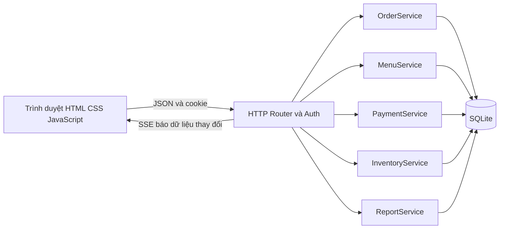
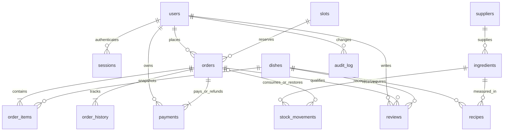
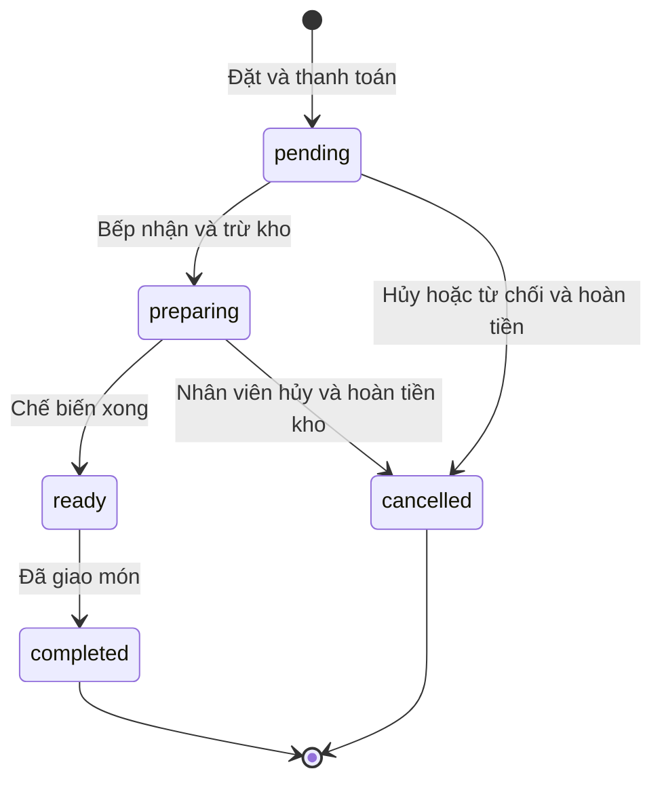

# Thiết kế hệ thống và API

## Ba lớp



`src/server.js` xác thực phiên, định tuyến và phát sự kiện. `src/services.js` chứa nghiệp vụ, tự kiểm tra vai trò nên không chỉ dựa vào việc ẩn nút ở giao diện. `src/db.js` và `schema.sql` quản lý lưu trữ và transaction. Frontend đọc lại dữ liệu khi nhận SSE, không tin payload do máy khách cung cấp về tiền, giá hoặc quyền.

## Mô hình dữ liệu



15 bảng: users, sessions, login_attempts, suppliers, ingredients, dishes, recipes, slots, orders, order_items, payments, stock_movements, order_history, reviews, audit_log. File SQL là nguồn chính xác.

Tiền dùng số nguyên VND, tránh lỗi làm tròn số thực. Lượng nguyên liệu lưu số nguyên phần nghìn đơn vị (1000 = 1g, 1ml hoặc 1 cái). API nhận tối đa 3 chữ số thập phân rồi đổi sang dạng nguyên. Mỗi nguyên liệu giữ nguyên đơn vị kể từ lúc tạo.

## Giao dịch và đồng thời

Mỗi nghiệp vụ ghi quan trọng chạy trong transaction ghi: `BEGIN IMMEDIATE` ở local hoặc `client.transaction('write')` trên Turso. Có lỗi thì rollback. Các lệnh database được `await`; AsyncLocalStorage và hàng đợi theo kết nối ngăn các yêu cầu đồng thời dùng lẫn transaction. SQLite/Turso giữ khóa ghi trong lúc kiểm tra và cập nhật số dư/tồn/chỗ. WAL và busy_timeout 5 giây hỗ trợ bản cục bộ. Trên Vercel, trình duyệt đọc lại dữ liệu mỗi 5 giây thay cho SSE, vì các instance serverless không chia sẻ bộ nhớ.

Thanh toán có UNIQUE(user_id, reference) và fingerprint nội dung. Gửi cùng mã và nội dung trả đơn cũ; cùng mã nhưng nội dung khác nhận 409. Thanh toán, hoàn tiền, tiêu hao và hoàn kho đều có khóa tham chiếu duy nhất. Frontend lưu request thanh toán đang chờ phản hồi vào localStorage và dùng lại đúng request khi khôi phục.

Trừ kho là bút toán `consume` có số lượng âm; hoàn dùng đối số của các bút toán đó, không tính lại Recipe hiện hành. Vì vậy sửa công thức không thay đổi lịch sử. Tồn không được âm ở cả service và CHECK constraint.



## HTTP API

Gốc `/api`. Request ghi dùng `Content-Type: application/json`. Phiên xác thực lưu cookie `canteengo`, HttpOnly, SameSite=Strict, thời hạn 24 giờ. Bật Secure khi có HTTPS. Lỗi trả `{ "error": "Thông báo tiếng Việt" }`; 400 dữ liệu sai, 401 chưa đăng nhập, 403 thiếu quyền, 404 không có, 409 xung đột nghiệp vụ, 429 giới hạn thử đăng nhập.

| Method | Endpoint | Quyền / chức năng |
|---|---|---|
| GET | /config, /me | Cấu hình demo và người dùng hiện tại |
| POST | /auth/register | Tạo khách, `{name,email?,phone?,password,kind}` |
| POST | /auth/login | `{identity,password}`; email hoặc SĐT |
| POST | /auth/logout | Xóa phiên |
| PUT | /profile | Người đăng nhập; `{name,phone,allergies}` |
| GET | /menu?date=YYYY-MM-DD | Thực đơn theo ngày nhận |
| GET | /dishes/:id/reviews | Đánh giá đã công bố |
| GET | /slots | Slot tương lai với used, remaining |
| GET | /events | SSE cho người đăng nhập; không gửi dữ liệu đơn trong payload |
| GET, POST | /orders | Danh sách theo quyền hoặc chốt đơn của khách |
| GET | /orders/:id | Chi tiết và lịch sử; kiểm tra chủ sở hữu |
| POST | /orders/:id/status | `{expected_status,status,reason?}` |
| POST | /orders/:id/reviews | Khách; `{dish_id,rating,comment}` |
| GET | /wallet/history | Giao dịch ví của mình |
| POST | /wallet/topup | Khách, demo; `{amount,reference}` |
| GET | /inventory, /inventory/history | Nhân viên/admin |
| POST | /inventory/adjust | `{ingredient_id,type,quantity,reason,reference}` |
| GET | /suppliers | Nhân viên/admin |
| GET, POST | /admin/menu | Admin: danh sách có Recipe hoặc tạo món |
| PUT, DELETE | /admin/menu/:id | Sửa hoặc xóa mềm |
| PUT | /admin/recipes/:dishId | `{lines:[{ingredient_id,unit,quantity}]}` |
| POST, PUT | /admin/ingredients, /admin/ingredients/:id | Tạo/sửa tên, đơn vị, ngưỡng, nhà cung cấp |
| POST, PUT | /admin/suppliers, /admin/suppliers/:id | Tạo/sửa tên, phone, address |
| GET | /admin/reports?from=...&to=... | Doanh thu, món, đối chiếu kho |
| GET | /admin/users, /admin/audit | Tài khoản và nhật ký quản trị |
| PUT | /admin/users/:id | `{role,active}`; thu hồi phiên cũ |

Ví dụ chốt đơn:

```json
{
  "reference": "UUID-moi-cho-giao-dich",
  "slot_id": "2026-09-15-11:00",
  "items": [
    {"dish_id":"chicken-rice","quantity":2,"price":35000,"note":"Không hành"}
  ]
}
```

`slot_id` phải lấy từ `/slots` hiện tại, không cố định theo ví dụ. Nếu mất phản hồi, gửi lại đúng reference và nội dung; không sinh mã khác cho cùng lần thanh toán chưa rõ kết quả.

## Bảo vệ và giới hạn

Mật khẩu scrypt với salt ngẫu nhiên; chỉ lưu SHA-256 của session token. Mọi API thao tác kiểm tra vai trò bằng dữ liệu phiên hiện hành. CSP cấm script ngoài, object và iframe; frontend escape chuỗi trước khi dựng HTML; truy vấn dùng bind parameters. Origin và JSON content type chặn form cross-origin. Đăng nhập khóa cặp IP/định danh sau 3 lần sai trong 60 giây.

Đây không phải hệ thống đã đánh giá an ninh độc lập. Chưa có xác minh hộp thư, reset mật khẩu, hạn mức đăng ký theo IP hoặc hạ tầng triển khai nhiều replica. Mã nhận đơn hiển thị 8 ký tự đầu UUID phục vụ đối chiếu thủ công; ID đầy đủ vẫn là khóa dữ liệu.
